# 2022 软件工程课程实践
## (学号：20201050449)
# 饿了么后端系统

## 技术说明

### 使用JPA和hibernate进行对象封装
### 使用ORM创建表和对象
### 使用SQL server数据库存储数据

## 功能介绍
### 管理员端
* 超级管理员可查看、新增、修改管理员的信息
* 修改管理员自己登录密码
* 查询所有商家信息
* 搜索、新增、删除商家   
* 查询指定商家的所有菜品           

### 商家端
* 查看商家自己的信息 
* 修改商家自己的信息   
* 修改商家自己的密码        
* 菜品管理
1. 查询所有菜品
2. 新增菜品          
3. 修改菜品          
4. 删除菜品 

###异常处理
* 当输入格式错误或信息错误时，系统能够正常运行并使用户重新输入，不会导致程序中断退出。

##商家登录页面展示
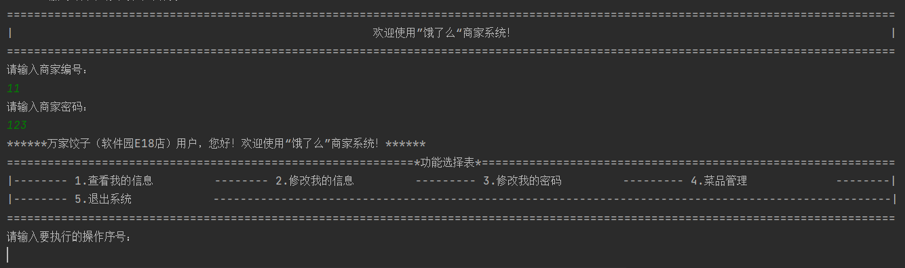

##管理员登录页面展示
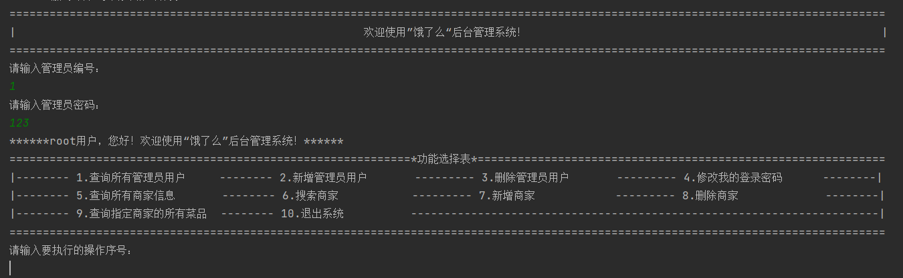

##商家菜品管理页面展示
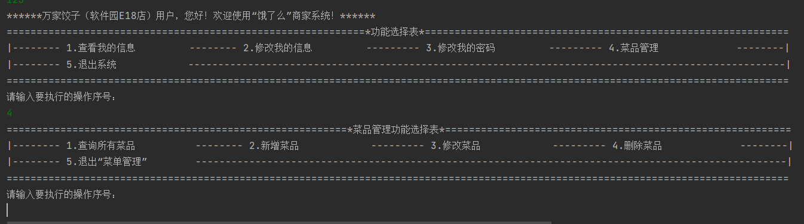

# 饿了么Web前端

## 技术说明

### 使用HTML5 CSS3 JavaScript（ES6 以上）和tailwindcss

## 功能介绍及运行截图

### 首页页面
* 显示点餐分类信息
* 点击点餐分类小图片，跳转到商家列表页面
* 点击下方菜单栏中的“订单”， 跳转到历史订单页面
  

### 商家列表页面
* 显示商家列表信息
* 点击某个商家，跳转到此商家的详细信息页面
  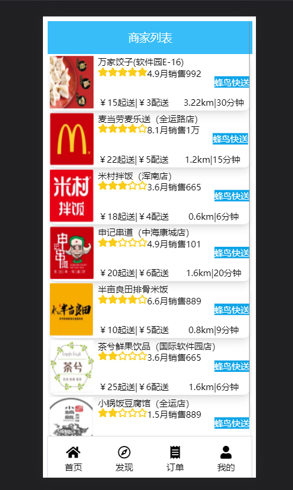

###商家详细信息页面
* 显示商家详细信息及所属食品信息
* 点击“去结算”按钮，跳转到确认订单页面
  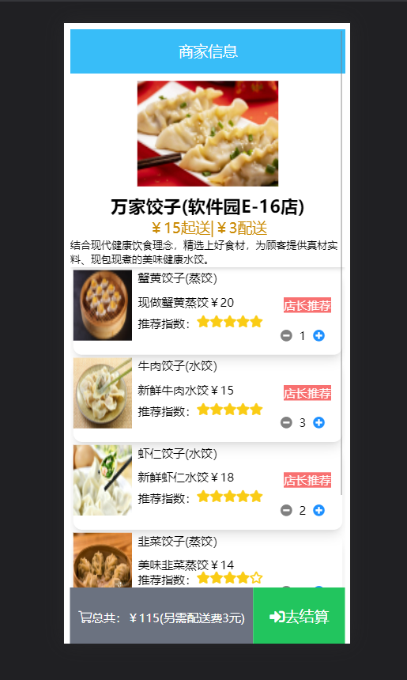

###确认订单页面
* 显示订单信息
* 选择送货地址
* 点击送货地址，跳转到送货地址列表页面
* 点击“去支付”按钮，跳转到支付页面
  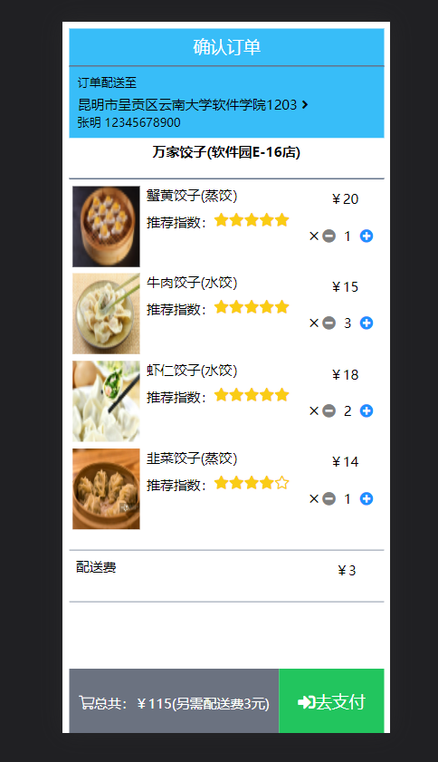

###在线支付页面
* 显示订单信息及订单明细信息
  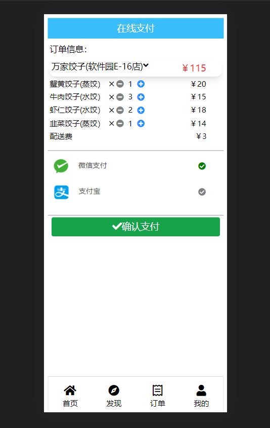 

###登录页面
* 用户登录
* 点击“登陆”按钮，跳转到上一个页面
* 点击“去注册”按钮，跳转到注册页面
  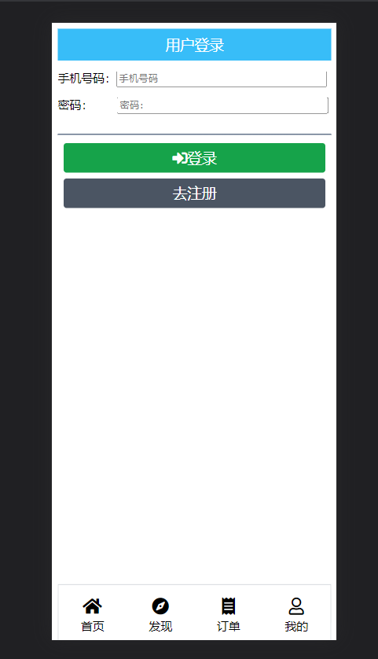

###注册页面
* 注册新用户
* 点击“注册”按钮，跳转到登陆页面
  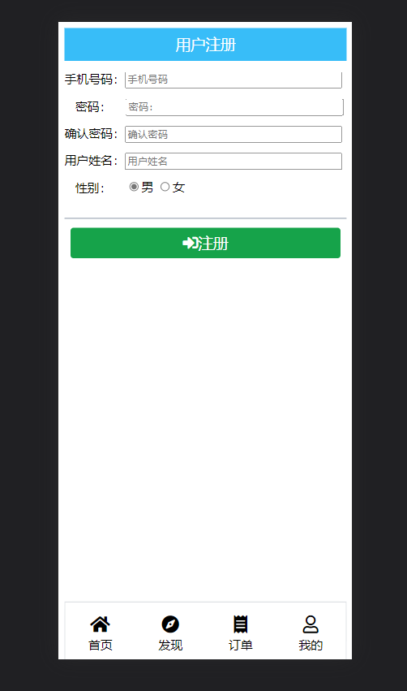

###历史订单页面
* 显示用户历史订单信息
* 点击某个历史订单，可以对订单明细信息进行显示和隐藏
  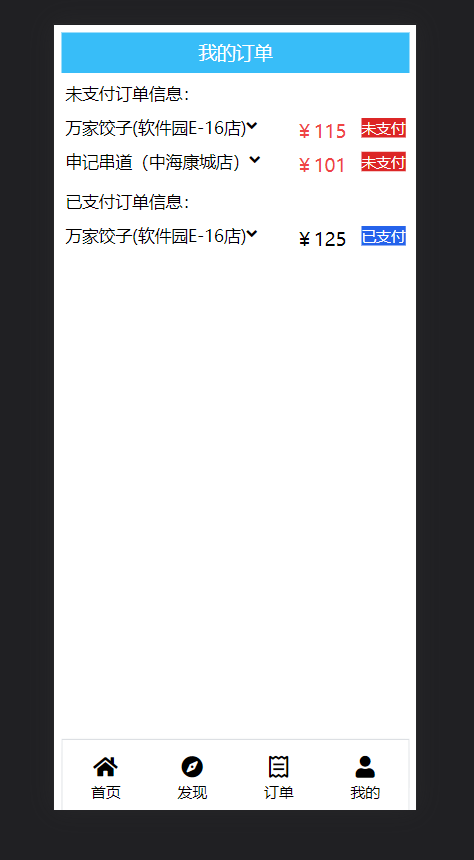
  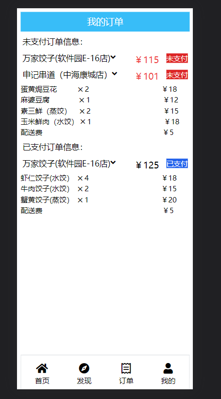
