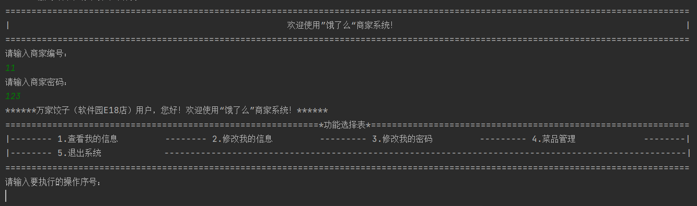
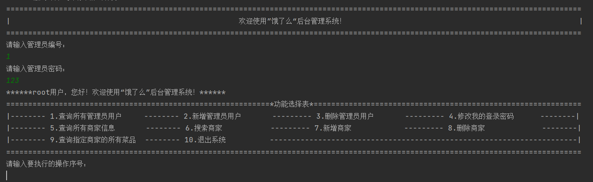
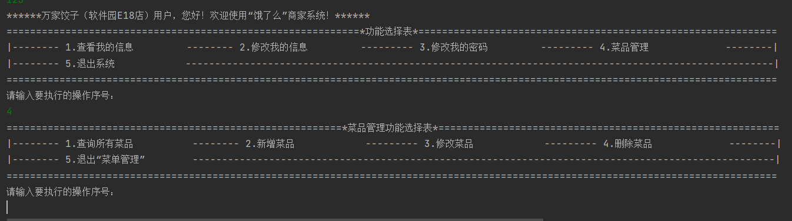

# 2022 软件工程课程实践
## (学号：20201050449)
# 饿了么后端系统

## 技术说明

### 使用JPA和hibernate进行对象封装
### 使用ORM创建表和对象
### 使用SQL server数据库存储数据

## 功能介绍
### 管理员端
* 超级管理员可查看、新增、修改管理员的信息
* 修改管理员自己登录密码
* 查询所有商家信息
* 搜索、新增、删除商家   
* 查询指定商家的所有菜品           

### 商家端
* 查看商家自己的信息 
* 修改商家自己的信息   
* 修改商家自己的密码        
* 菜品管理
1. 查询所有菜品
2. 新增菜品          
3. 修改菜品          
4. 删除菜品 

###异常处理
* 当输入格式错误或信息错误时，系统能够正常运行并使用户重新输入，不会导致程序中断退出。

##商家登录页面展示

##管理员登录页面展示

##商家菜品管理页面展示

